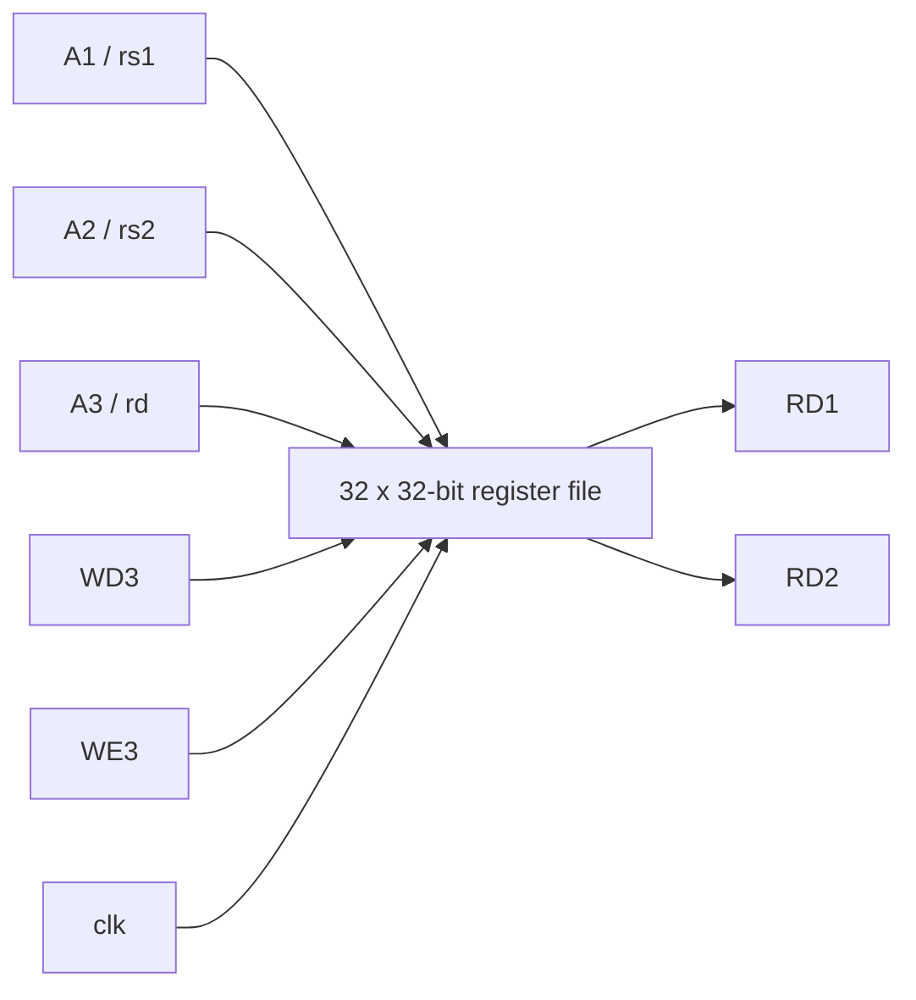

# Subproject 04 - RV32I Register File

## Engineering objective

Implement the architectural register state used by the datapath: two independent
combinational read ports, one synchronous write port, and the mandatory RISC-V
`x0` invariant.



## Architectural behavior

- `RD1` and `RD2` respond combinationally to `A1` and `A2`.
- `WD3` is written to `A3` on a rising edge when `WE3=1`.
- Writes targeting register zero are suppressed.
- Reads of register zero return zero independently of array contents.

## Reset trade-off

The model synchronously clears all 32 entries for deterministic simulation. This
is intentionally explicit in the README because a production FPGA or ASIC may
prefer initialization files, valid bits, or technology-specific storage instead
of a full-array reset network.

## Verification strategy

The testbench covers reset state, writes to two registers, simultaneous reads,
write-enable suppression, attempted writes to `x0`, and a second reset.

## Run

```bash
vsim -c -do run_questa.do
gtkwave register_file.vcd
```

Expected verdict: `TEST REGISTER FILE PASSED`.

## Review focus

The key invariant is enforced twice: writes to `x0` are blocked and reads of
`x0` are explicitly forced to zero. This prevents accidental architectural state
corruption even before reset completes.

## Verification matrix

| Requirement | Evidence |
|---|---|
| Two independent read ports | Two written registers are read simultaneously |
| Rising-edge write | Data becomes architectural state only after the active edge |
| Write-enable gating | A disabled write leaves the destination unchanged |
| `x0` invariant | Attempted writes are discarded and reads always return zero |
| Deterministic reset | All visible registers return to zero after reset |

## Integration role

The register file supplies `rs1` and `rs2` in the same cycle and commits `rd` at
the following rising edge. This behavior supports the single-cycle datapath
without an additional read stage.

## Scope boundary

The full-array reset is a simulation-oriented modeling choice and may infer a
large reset network in synthesis. A production implementation would review
technology-specific register-file macros, initialization strategy, read-during-
write semantics, and timing closure.
